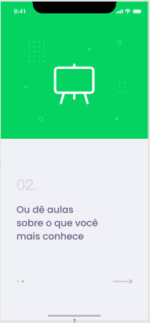

<h1 align="center">
    
</h1>

<h4 align="center">
  🚀&nbsp;&nbsp;&nbsp;Next Level Week #2
</h4>

  

  
  

## :rocket:&nbsp;&nbsp;&nbsp;Tecnologias

Esse projeto foi desenvolvido com as seguintes tecnologias:

- [Node.js](https://nodejs.org/en/)
- [React](https://reactjs.org)
- [React Native](https://facebook.github.io/react-native/)
- [Expo](https://expo.io/)

## 💻 Projeto

Proffy é uma plataforma criada para unir alunos e professores.

## 🔖 Layout

A [Rocketseat](https://rocketseat.com.br/), disponibilizou os layouts para as plataformas [mobile](https://www.figma.com/file/e33KvgUpFdunXxJjHnK7CG/?viewer=1&node-id=) e [web](https://www.figma.com/file/GHGS126t7WYjnPZdRKChJF/?viewer=1&node-id=).
